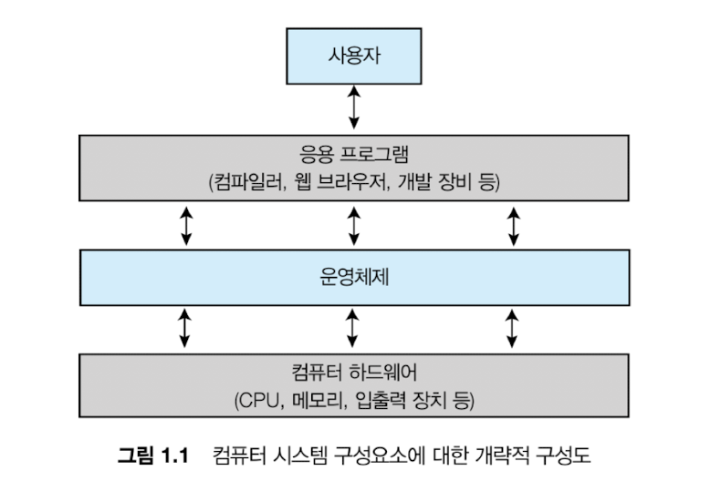
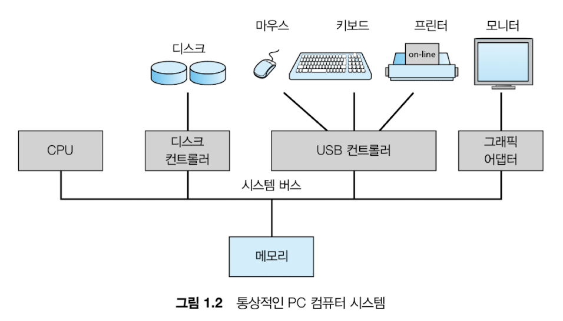
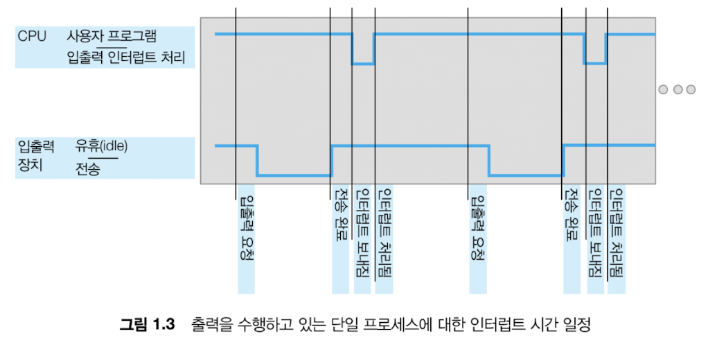
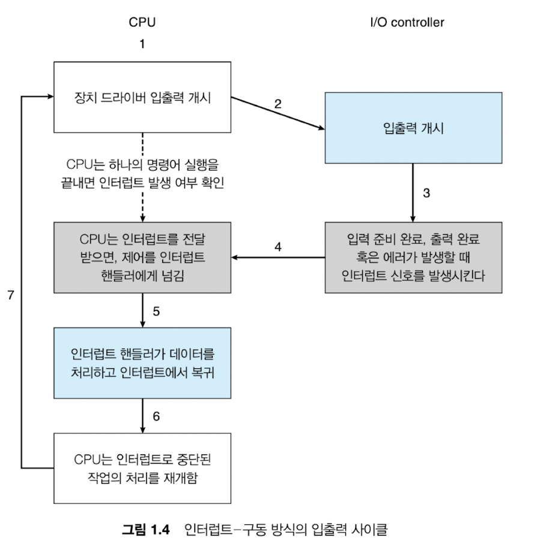
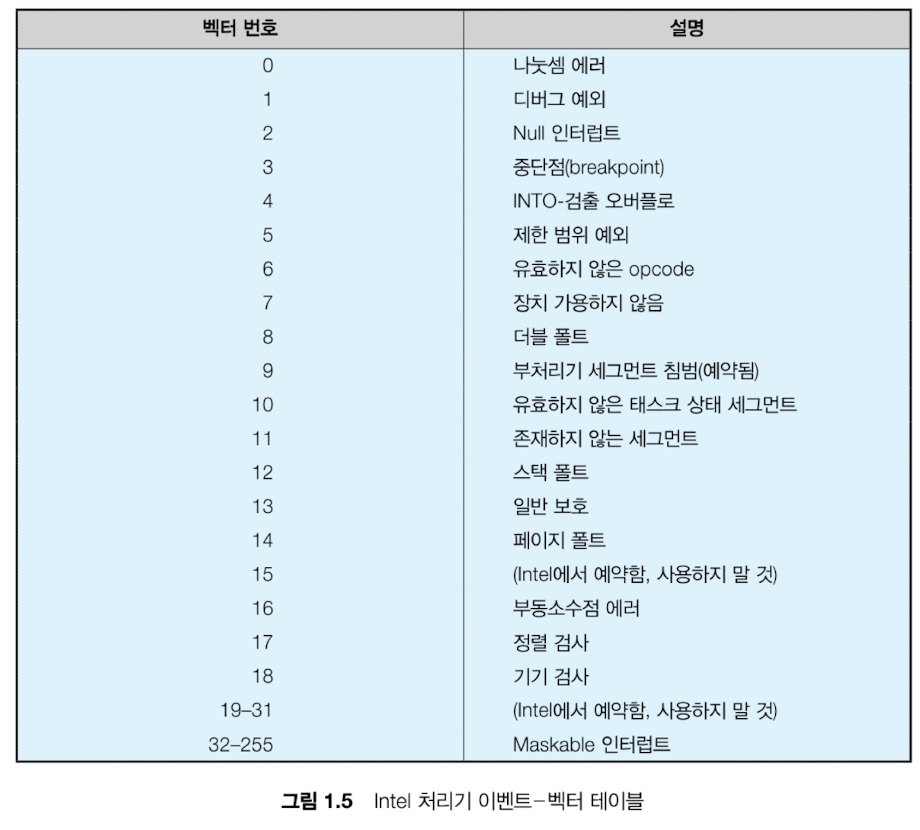

# 1.1 운영체제가 할 일

- **하드웨어**: 중앙 처리 장치(CPU), 메모리 및 입출력 장치(I/O)
- **응용 프로그램**: 워드 프로세서, 스프레드시트, 컴파일러, 웹 브라우저 등
- **운영체제**:
  - 다양한 사용자를 위해 다양한 응용 프로그램 간의 하드웨어 사용을 제어하고 조정한다.
  - 즉, 컴퓨터 시스템이 동작할 때 자원(_하드웨어, 소프트웨어, 데이터 등_)을 적절하게 사용할 수 있는 방법을 제공한다.
  - 운영체제는 “컴퓨터를 대신 관리해주는 관리자”다. CPU, 메모리, 디스크 같은 하드웨어는 그냥 자원일 뿐이고, 이걸 누가 어떻게 쓸지 결정해주는 게 운영체제다. 그래서 운영체제 없이 프로그램이 바로 하드웨어를 건드리는 구조는 사실상 불가능하다.

 

## 1.1.1 사용자 관점
- 사용자 관점에서의 운영체제는 **편하게 쓰게 해주는 존재**다.
- 사용자는 CPU 스케줄링, 메모리 관리 등 신경 쓰지 않는다. 그냥 앱이 빠르고 잘 돌아가면 된다.
- 그래서 운영체제는 내부적으로 복잡한 일을 하면서도 겉으로는 단순하게 보이게 만든다.
  - PC에서 키보드와 마우스, 모바일에서는 터치나 음성으로 인터페이스를 제공하는 것도 이 역할

 

## 1.1.2 시스템 관점
- 시스템 관점에서 운영체제는 **자원 할당자**다.
- CPU 시간, 메모리 공간, 디스크, I/O 장치 같은 걸 여러 프로그램이 동시에 쓰려고 하기 때문에 충돌이 발생한다. 이걸 공정하고 효율적으로 나눠주는 게 운영체제다.
  - 누가 먼저 CPU를 쓸지, 메모리를 얼마나 줄지, 디스크 접근 순서를 어떻게 할지 이런 걸 다 결정한다.
- 동시에 운영체제는 **제어 프로그램**이기도 해서, 프로그램이 이상한 짓을 못 하게 막고 시스템을 안정적으로 유지한다.

 

## 1.1.3 운영체제의 정의
- 운영체제는 하드웨어를 직접 다루기 어렵기 때문에, 그 위에 공통 기능을 제공하고 자원을 관리해주는 소프트웨어다.
- 중요한 포인트는 운영체제는 직접 “유용한 기능”을 만드는 게 아니라, 다른 프로그램들이 제대로 돌아가게 환경을 만들어주는 존재다.
- 그리고 운영체제 자체도 하나의 덩어리가 아니라 구조가 있다. 핵심은 **커널**이다.
- 커널은 항상 메모리에 올라가 있고, 실제로 CPU 스케줄링, 메모리 관리, 파일 시스템 같은 핵심 기능을 담당한다. 그 위에 시스템 프로그램들이 있고, 우리가 직접 쓰는 건 응용 프로그램이다.

 
 

# 1.2 컴퓨터 시스템의 구성

> **핵심!**   컴퓨터는 CPU, 메모리, 그리고 여러 장치들이 하나의 통로인 **버스**를 통해 연결되어 동작한다.
- 현대 컴퓨터는 CPU와 메모리, 그리고 다양한 장치들이 서로 데이터를 주고받아야 한다. 이때 모든 장치는 각각 따로 연결되는 게 아니라, 하나의 공통 통로인 버스를 통해 연결된다. 그리고 각 장치는 직접 CPU와 통신하는 것이 아니라, 중간에 장치 컨트롤러라는 관리자를 통해 제어된다.
- **장치 컨트롤러**는 **특정** 장치를 담당한다. 예를 들어 디스크, 오디오, 그래픽 같은 장치를 **각각** 관리한다. 하나의 컨트롤러가 **여러 장치를 동시에 담당**할 수도 있다. USB 포트에 여러 기기를 꽂을 수 있는 것도 이런 구조 때문이다. 이 컨트롤러는 장치를 제어하기 위한 작은 메모리와 레지스터를 내부에 가지고 있고, 실제 장치와 데이터를 주고받는 역할을 한다.
- 운영체제 입장에서는 장치마다 동작 방식이 다르면 관리가 어렵다. 그래서 **장치 드라이버**라는 소프트웨어를 둔다. 이 드라이버는 해당 장치 컨트롤러의 동작을 잘 이해하고, 운영체제에게는 “이 장치는 이렇게 쓰면 된다”라는 통일된 인터페이스를 제공한다. 즉, 운영체제는 복잡한 하드웨어를 몰라도 되고, 드라이버가 그 차이를 흡수해준다.
- **CPU**와 **장치 컨트롤러**는 동시에 동작하면서 메모리를 사용하려고 한다. 이때 서로 충돌이 나지 않도록 메모리 접근을 조정해주는 역할을 하는 것이 **메모리 컨트롤러**다. 이걸 통해 여러 장치가 동시에 메모리를 사용해도 문제가 없도록 순서를 맞춘다.
- 결국 전체 흐름은 CPU와 여러 장치는 **버스**로 연결되어 있고, 장치는 **컨트롤러**를 통해 관리되며, 운영체제는 **드라이버**를 통해 장치를 추상화해서 사용한다. 그리고 이 모든 과정에서 메모리 접근 충돌은 **메모리 컨트롤러**가 정리해준다.

 

## 1.2.1 인터럽트
- 일반적인 컴퓨터 작업을 고려하자. 입출력 작업을 시작하기 위해 장치 드라이버는 장치 컨트롤러의 적절한 레지스터에 값을 적재한다.
- 그 다음 장치 컨트롤러는 이러한 레지스터의 내용을 검사하여 수행할 작업을(예: "키보드에서 문자 읽기") 결정한다.
- 컨트롤러는 장치에서 로컬 버퍼로 데이터 전송을 시작한다.
- 데이터 전송이 완료되면 장치 컨트롤러는 장치 드라이버에게 작업이 완료 되었음을 알린다.
- 그 다음 장치 드라이버는 읽기 요청이면 데이터나 데이터에 대한 포인터를 반환하며 운영체제의 다른 부분에 제어를 넘긴다.
- 다른 작업의 경우 장치 드라이버는 "쓰기 완료" 또는 "장치 사용 중"과 같은 상태 정보를 반환한다.
- 그러나 컨트롤러는 장치 드라이버에게 작업을 완료했다는 사실을 어떻게 알릴까? 그것은 **인터럽트**를 통해 이루어진다.

 

### 1.2.1.1 개요
- 하드웨어는 어느 순간이든 시스템 버스를 통해 CPU에 신호를 보내 인터럽트를 발생시킬 수 있다.
  - 시스템 버스는 여러 버스 중 주요 구성요소 사이의 주요 통신 경로이다.
- CPU가 인터럽트 되면, CPU는 하던 일을 중단하고 즉시 고정된 위치로 실행을 옮긴다.
  - 고정된 위치는 일반적으로 인터럽트를 위한 서비스 루틴이 위치한 시작 주소를 가지고 있다.
- 그러면 인터럽트 서비스 루틴이 실행된다.
- 인터럽트 서비스 루틴의 실행이 완료되면, CPU는 인터럽트 되었던 연산을 다시 재개한다.
  
  - 이러한 연산의 시간 일정은 위 그림을 참고하자.
- 인터럽트는 컴퓨터 구조의 중요한 부분이며, 각 컴퓨터 설계는 자신의 인터럽트 메커니즘을 가지고 있고, 몇 가지 기능은 공통적이다.
- 인터럽트는 적절한 서비스 루틴으로 제어를 전달한다.
  - 이러한 전달을 관리하는 방법은 **인터럽트 정보를 조사하는 일반적인 루틴을 호출**하면 된다.
  - 이 루틴은 이어서 인터럽트 고유의 핸들러를 호출한다.
  - 그러나, 인터럽트는 매우 빈번하게 발생하므로 빠르게 처리되어야 한다.
  - 필요한 속도를 제공하기 위해 인터럽트 루틴에 대한 포인터들의 테이블을 핸들러 호출 대신 이용할 수 있다.
- 테이블을 이용할 시에는 중간 루틴을 둘 필요 없이, 테이블을 통하여 간접적으로 인터럽트 루틴이 호출될 수 있다.
  - 일반적으로 포인터들의 테이블은 하위 메모리에 저장된다.
  - 이들 위치에는 여러 장치에 대한 인터럽트 서비스 루틴의 주소가 들어 있다.
- 인터럽트가 요청되면, 인터럽트를 유발한 장치를 위한 인터럽트 서비스 루틴의 주소를 제공하기 위해 이 주소의 배열, 즉 **인터럽트 벡터**가 인터럽트 요청과 함께 주어진 고유의 유일한 장치 번호로 색인된다.
- 인터럽트 구조는 인터럽트된 모든 정보를 저장해야 인터럽트를 처리한 후 해당 정보를 복원할 수 있다.
- 만약 인터럽트 루틴이 처리기의 상태를 변경할 필요가 있다면, 인터럽트 루틴은 반드시 명시적으로 현재의 상태를 저장하여야 하며, 복귀하기 전에 상태를 복원해야 한다.
- 인터럽트를 서비스한 후, 저장되어 있던 복귀 주소를 프로그램 카운터에 적재하고, 인터럽트에 의해 중단되었던 연산이 인터럽트가 발생되지 않았던 것처럼 다시 시작된다.

 

### 1.2.1.2 구현
- 기본 인터럽트 메커니즘
  - CPU 하드웨어에는 **인터럽트 요청 라인**이라는 선이 있다. 하나의 명령어 실행을 완료할 때마다 CPU가 이 선을 감지한다.
  - 컨트롤러가 인터럽트 요청 라인에 신호를 보낸 것을 CPU가 감지하면, 인터럽트 번호를 읽고 이 번호를 인터럽트 벡터의 인덱스로 사용하여 **인터럽트 핸들러 루틴**으로 점프한다.
  - 그 다음 해당 인덱스와 관련된 주소에서 실행을 시작한다.
  - 인터럽트 처리기는 작업 중에 변경될 상태를 저장하고, 인터럽트 원인을 확인하고, 필요한 처리를 수행하고, 상태 복원을 수행하고, `return_from_interrupt` 명령어를 실행하여 CPU를 인터럽트 전 실행 상태로 되돌린다.
- 요약하면, 장치 컨트롤러가 인터럽트 요청 라인에 신호를 선언하여 인터럽트를 **발생** 시키고, CPU는 인터럽트를 **포착**하여 인터럽트 핸들러로 **디스패치**하고, 핸들러는 장치를 서비스하여 인터럽트를 **지운다**.

- 위 그림은 인터럽트-구동 입출력 사이클을 요약한 것이다.
- 방금 설명한 기본 인터럽트 기법은 장치 컨트롤러가 서비스할 준비가 될 떄와 같은 **비동기 이벤트**에 CPU가 대응할 수 있게 한다.
- 그러나 최신 운영체제에서는 더욱 정교한 인터럽트 처리 기능이 필요하다.
  1. _중요한 처리 중_ 에 인터럽트 처리를 **연기**할 수 있어야 한다.
  2. 장치의 적절한 인터러브 핸들러로 _효율적으로_ 디스패치 할 방법이 필요하다.
  3. 운영체제가 우선순위가 높은 인터럽트와 우선순위가 낮은 인터럽트를 구분하고 적절한 긴급도로 대응할 수 있도록 **다단계 인터럽트**가 필요하다.
- 최신 컴퓨터 하드웨어에서 이 3가지 기능은 CPU 및 **인터럽트 컨트롤러 하드웨어**에 의해 제공된다.
- 대부분의 CPU에는 2개의 인터럽트 요청 라인이 있다.
  - 하나는 복구할 수 없는 메모리 오류와 같은 이벤트를 위해 예약된 **마스크 불가능 인터럽트**이다.
  - 두번째는 **마스킹 가능** 인터럽트 라인이다.
    - 인터럽트 되어서는 안되는 중요한 명령 시퀀스를 실행하기 전에 CPU에 의해 꺼질 수 있다.
    - 장치 컨트롤러가 서비스를 요청하기 위해 사용된다.
- 처음에는 인터럽트 벡터만 있으면 충분하다. 인터럽트 번호를 보고 바로 해당 핸들러로 점프하면 되니까 빠르다. 그런데 현실에서는 문제가 생긴다. 장치가 너무 많다. 인터럽트 벡터 테이블 크기는 제한돼 있는데, 처리해야 할 인터럽트 종류는 더 많다.
- 그래서 나온 게 **인터럽트 체인**이다. 이건 하나의 벡터가 여러 핸들러를 가리키는 구조다.
- 동작은 `인터럽트 발생 → 해당 벡터로 이동 → 연결된 핸들러 리스트를 순서대로 실행 → “이거 내가 처리할 인터럽트 맞음” 하는 핸들러가 나오면 거기서 처리하고 종료`
  - 즉, 한 번에 바로 찾는 대신 **리스트를 따라가면서 찾는 방식**이다.
  - 속도는 조금 느려지지만, 장치 수 제한 문제를 해결할 수 있다.
  - 결국 “속도 vs 확장성” 트레이드오프에서 나온 절충안이다.
  
  - 위 그림은 Intel 프로레서의 인터럽트 벡터 설계다.
  - 마스크 불가능한 0~31 이벤트는 다양한 오류 조건을 알리는 데 사용된다.
  - 마스크 가능한 32~255 이벤트는 장치가 생성한 인터럽트 같은 그 외 인터럽트를 처리하기 위해 사용된다.

- 인터럽트 기법은 또한 **인터럽트 우선순위 레벨**을 구현한다.
- 이러한 레벨을 통해 CPU는 모든 인터럽트를 마스킹 하지 않고도 우선순위가 낮은 인터럽트 처리를 연기할 수도 있고, 우선순위가 높은 인터럽트가 우선순위가 낮은 인터럽트의 실행을 선점할 수 있다.
  - CPU는 현재 처리 중인 인터럽트보다 더 높은 우선순위가 오면 바로 갈아탄다.
  - 인터럽트가 동시에 옴 → 우선순위 필요 → 중요한 것 먼저 처리

