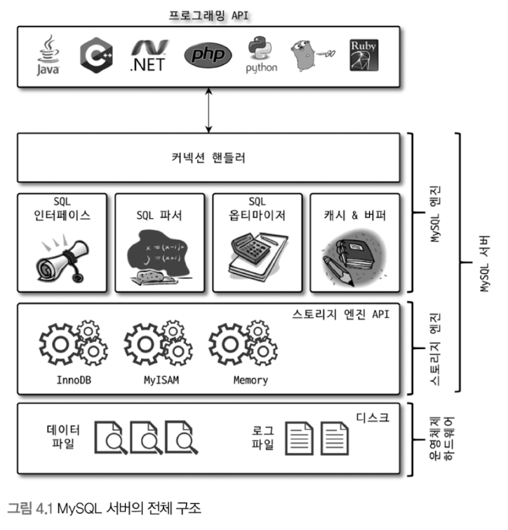
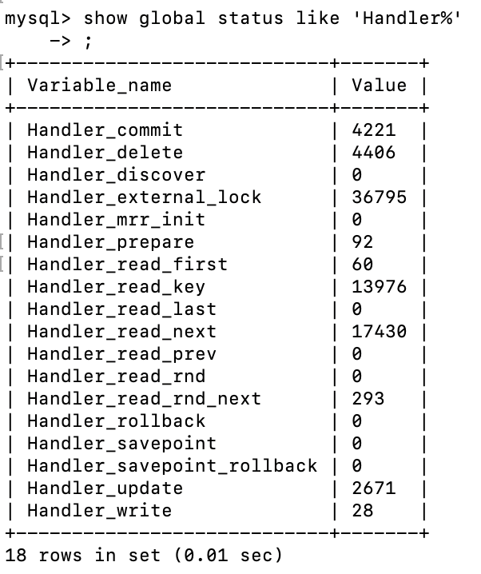
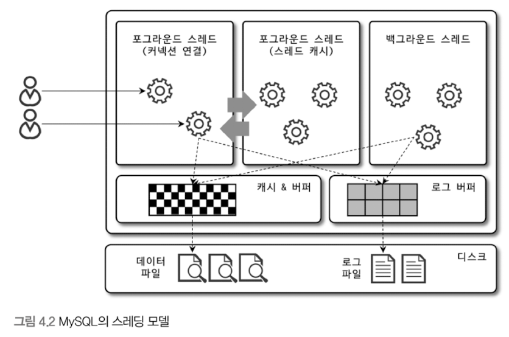
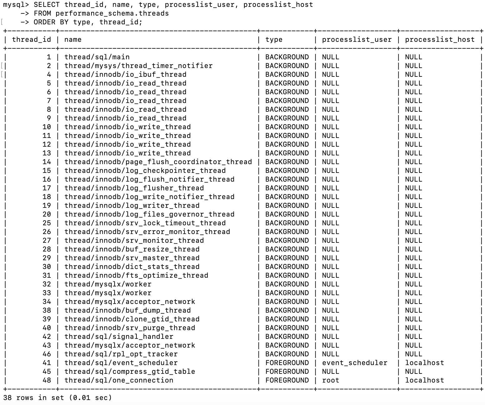
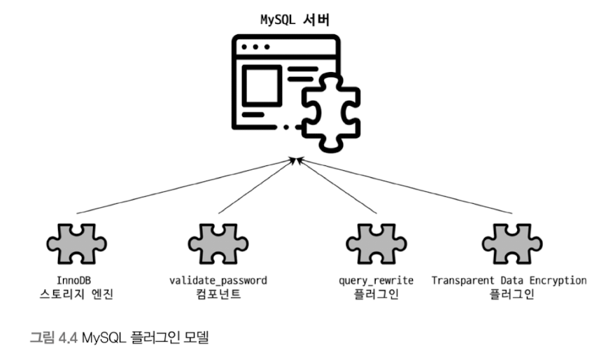
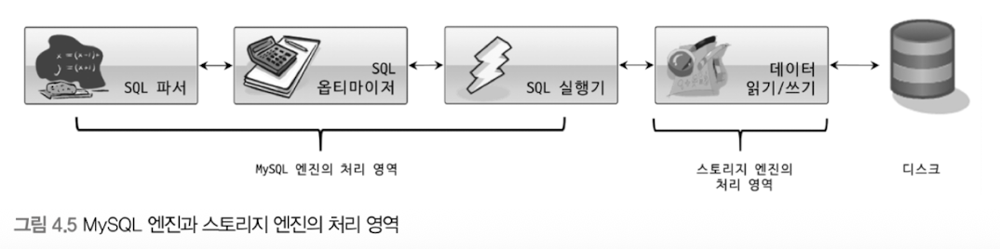
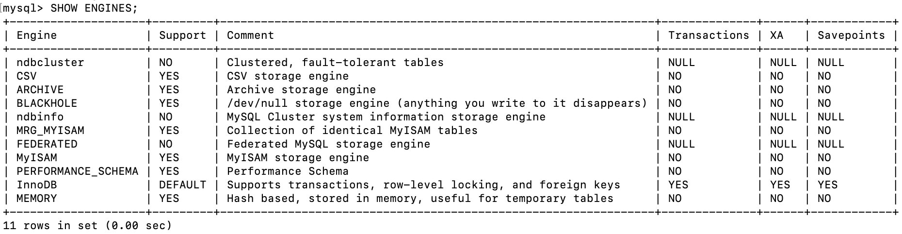

# 4.1 MySQL 엔진 아키텍처
## 4.1.1 MySQL의 전체 구조




- 대부분의 프로그래밍 언어로부터 접근 방법을 모두 지원한다.
- 크게 MySQL 엔진과 스토리지 엔진으로 구분할 수 있다.

<br>

### 4.1.1.1 MySQL 엔진
- 클라이언트로부터의 접속 및 쿼리 요청을 처리하는 커넥션 핸들러
- SQL 파서 및 전처리기
- 쿼리의 최적화된 실행을 위한 옵티마이저

MySQL 엔진은 위 3가지가 중심을 이룬다.
또한 MySQL은 표준 SQL 문법을 지원하기 때문에 표준 문법에 따라 작성된 쿼리는 타 DBMS와 호환되어 실행될 수 있다.

<br>

### 4.1.1.2 스토리지 엔진
- MySQL 엔진은 **요청된 SQL 문장을 분석하거나 최적화하는 등** DBMS의 두뇌에 해당하는 처리를 수행하고,
- **실제 데이터를 디스크 스토리지에 저장하거나 디스크 스토리지로부터 데이터를 읽어보는 부분**은 스토리지 엔진이 전담한다.
- MySQL 서버에서 MySQL 엔진은 하나지만 스토리지 엔진은 여러 개를 동시에 사용할 수 있다.

```sql
CREATE TABLE test_table (fd1 INT, fd2 INT) ENGINE=INNODB
```

- 위 예제와 같이 테이블이 사용할 스토리지 엔진(INNODB)을 지정하면 이후 해당 테이블의 모든 읽기 작업이나 변경 작업은 정의된 스토리지 엔진이 처리한다.
- 위 예제에서 `test_table`은 InnoDB 스토리지 엔진을 사용하도록 정의했다. 이제 `test_table`에 대해 `INSERT`, `UPDATE`, `SELECT`, ... 등의 작업이 발생하면 InnoDB 스토리지 엔진이 처리를 담당한다.
- 그리고 각 스토리지 엔진은 성능 향상을 위해 키 캐시(MyISAM 스토리지 엔진)나 InnoDB 버퍼 풀(InnoDB 스토리지 엔진)과 같은 기능을 내장하고 있다.

<br>

### 4.1.1.3 핸들러 API
- MySQL 엔진의 쿼리 실행기에서 데이터를 쓰거나 읽어야 할 때는 각 스토리지 엔진에 쓰기 또는 읽기를 요청하는데, 이러한 요청을 **핸들러 요청**이라 하고, 여기서 사용되는 API를 핸들러 API라고 한다.
- InnoDB 스토리지 엔진 또한 이 핸들러 API를 이용해 MySQL 엔진과 데이터를 주고받는다.
- 이 핸들러 API를 통해 얼마나 많은 데이터 작업이 있었는지는 `SHOW GLOBAL STATUS LIKE 'Handler%';` 명령어로 확인할 수 있다.

  


<br>
<br>

## 4.1.2 MySQL 스레딩 구조

- MySQL 서버는 프로세스 기반이 아니라 스레드 기반으로 작동하며, 크게 **포그라운드 스레드**와 **백그라운드 스레드**로 구분할 수 있다.
- MySQL 서버에서 실행 중인 스레드의 목록은 다음과 같이 `performance_schema` 데이터 베이스의 `threads` 테이블을 통해 확인할 수 있다.

  
- 위 사진은 내 컴퓨터에서 직업 쿼리를 실행해 본 결과이다. 책에서의 결과와 달리 내 서버에서는 현재 38개의 스레드가 실행 중이며, 그 중에서 포그라운드 스레드로 표시되어 있는 건 3개이다.
  - `thread/sql/event_scheduler` → MySQL 내부 이벤트 실행 (사용자 요청 아님)
  - `thread/sql/compress_gtid_table` → 내부 관리 작업 (사용자 요청 아님)
  - `thread/sql/one_connection` → 클라이언트 연결 = 실제 사용자 쿼리 처리
- 동일한 이름의 스레드가 2개 이상씩 보이는 것은 MySQL 서버의 설정 내용에 의해 여러 스레드가 동일 작업을 병렬로 처리하는 경우다.

<br>

### 4.1.2.1 포그라운드 스레드(클라이언트 스레드)
- 포그라운드 스레드는 **최소한 MySQL 서버에 접속된 클라이언트의 수만큼 존재**하며, 주로 **각 클라이언트 사용자가 요청하는 쿼리 문장을 처리**한다.
- 클라이언트 사용자가 작업을 마치고 커넥션을 종료하면 해당 커넥션을 담당하던 스레드는 다시 스레드 캐시로 되돌아간다.
- 이때 이미 스레드 캐시에 일정 개수 이상의 대기 중인 스레드가 있으면 스레드 캐시에 넣지 않고 스레드를 종료시켜 일정 개수의 스레드만 스레드 캐시에 존재하게 한다.
- 이때 **스레드 캐시에 유지할 수 있는 최대 스레드 개수**는 `thread_cache_size` 시스템 변수로 설정한다.

<br>

- 포그라운드 스레드는 데이터를 **MySQL의 데이터 버퍼**나 **캐시**로부터 가져오며, 버퍼나 캐시에 없는 경우에는 **직접 디스크의 데이터**나 **인덱스 파일**로부터 데이터를 읽어와서 작업을 처리한다.
- **MyISAM 테이블**은 _디스크 쓰기 작업까지_ 포그라운드 스레드가 처리 하지만 **InnoDB 테이블**은 _데이터 버퍼나 캐시까지만_ 포그라운드 스레드가 처리하고, 나머지 _버퍼로부터 디스크까지 기록하는 작업_ 은 백그라운드 스레드가 처리한다.


<br>

### 4.1.2.2 백그라운드 스레드
- MyISAM의 경우에는 별로 해당사항이 없지만 InnoDB는 다음과 같이 여러 작업이 백그라운드로 처리된다.
  + 인서트 버퍼를 병합하는 스레드
  + 로그를 디스크로 기록하는 스레드
  + InnoDB 버퍼 풀의 데이터를 디스크에 기록하는 스레드
  + 데이터를 버퍼로 읽어 오는 스레드
  + 잠금이나 데드락을 모니터링하는 스레드
- 가장 중요한 것은 **로그 스레드**와 버퍼와 데이터를 디스크로 내려쓰는 작업을 처리하는 **쓰기 스레드**일 것이다.
- MySQL 5.5 버전부터 데이터 쓰기 스레드와 읽기 스레드 개수를 2개 이상 지정할 수 있게 됐으며, `innodb_write_io_threads`와 `innodb_read_io_threads` 시스템 변수로 스레드의 개수를 설정한다.
- InnoDB에서도 데이터를 읽는 작업은 주로 클라이언트 스레드에서 처리되기 때문에 읽기 스레드는 많이 설정할 필요가 없지만 **쓰기 스레드**는 아주 많은 작업을 백그라운드로 처리하기 때문에 _일반적인 내장 디스크를 사용_ 할 때는 **2~4** 정도, _DAS나 SAN과 같은 스토리지를 사용_ 할 때는 디스크를 최적으로 사용할 수 있을 만큼 충분히 설정하는 것이 좋다.
- 일반적으로 쓰기 작업은 지연(버퍼링)되어 처리될 수 있지만 읽기 작업은 절대 지연될 수 없다. **InnoDB에서는 쓰기 작업을 버퍼링해서 일괄 처리하는 기능이 탑재**되어 있다. 하지만 MyISAM은 그렇지 않고 사용자 스레드가 쓰기 작업까지 함께 처리하도록 설계돼 있다.
- 따라서 InnoDB에서는 DML 쿼리로 데이터가 변경되는 경우 _데이터가 디스크의 데이터 파일로 완전히 저장될 때까지 기다리지 않아도 된다._

<br>
<br>

## 4.1.3 메모리 할당 및 사용 구조
- MySQL에서 사용되는 메모리 공간은 크게 **글로벌 메모리 영역**과 **로컬 메모리 영역**으로 구분할 수 있다.

<br>

### 4.1.3.1 **글로벌 메모리 영역**
- 일반적으로 클라이언트 스레드의 수와 무관하게 **하나의 메모리 공간만 할당**된다.
- 단, 필요에 따라 2개 이상의 메모리 공간을 할당받을 수도 있지만 이는 클라이언트 스레드 수와는 무관하다. 생성된 글로벌 영역이 N개라 하더라도 **모든 스레드에 의해 공유된다.**

- 대표적인 글로벌 메모리 영역:
  - 테이블 캐시
  - InnoDB 버퍼 풀
  - InnoDB 어댑티브 해시 인덱스
  - InnoDB 리두 로그 버퍼

<br>

> 쉽게 말하면, 터미널을 여러 개 여러 각각 MySQL 서버를 따로 들어간다면 각각 하나의 스레드가 될 것이다. 하지만, 글로벌 메모리 영역은 그 스레드의 수와 무관하게 모두 공유되는 메모리 영역을 일컫는 말이다.

> 예를 들어 InnoDB 버퍼 풀을 생각해보면, 어떤 터미널에서 SELECT를 해서 데이터를 읽으면 디스크에서 읽어와서 버퍼 풀에 올라간다. 그 다음에 _다른 터미널에서 같은 데이터를 조회_ 하면 다시 디스크를 읽는 게 아니라 **이미 올라와 있는 버퍼 풀을 그대로 사용**한다. 이게 “모든 스레드가 공유한다”는 의미다.

<br>

### 4.1.3.2 **로컬 메모리 영역**
- MySQL 서버 상에 존재하는 클라이언트 스레드가 쿼리를 처리하는데 사용하는 메모리 영역이다.

  
- 아까 소개한 그림 4.2에서 볼 수 있듯이 클라이언트가 MySQL 서버에 접속하면 MySQL 서버에서는 클라이언트 커넥션으로부터의 요청을 처리하기 위해 스레드를 하나씩 할당하게 된다.
- 클라이언트 스레드가 사용하는 메모리 공간이라고 해서 **클라이언트 메모리 영역**이라고도 한다.
- 클라이언트와 MySQL 서버와의 커넥션을 세션이라고 하기 때문에 **세션 메모리 영역**이라고도 표현한다.
- 로컬 메모리 영역은 각 클라이언트 스레드 별로 **독립적으로 할당**되며 **절대 공유되어 사용되지 않는다**는 특징이 있다.
- 일반적으로 글로벌 메모리 영역의 크기는 주의해서 설정하지만 소트 버퍼와 같은 로컬 메모리 영역은 크게 신경쓰지 않고 설정하는데, 최악의 경우에는 MySQL 서버가 메모리 부족으로 멈춰버릴 수도 있으므로 적절한 메모리 공간을 설정하는 것이 중요하다.
- 또 하나의 중요한 특징은 **각 쿼리의 용도별로 필요할 때만 공간이 할당**되고 필요하지 않은 경우에는 MySQL이 메모리 공간을 할당조차도 하지 않을 수도 있다는 점이다.
  - 대표적으로 소트 버퍼나 조인 버퍼와 같은 공간이 그렇다.
- 그리고 로컬 메로리 공간은 커넥션이 열려 있는 동안 **계속 할당된 상태**로 남아있는 공간도 있고(_커넥션 버퍼나 결과버퍼_) 그렇지 않고 쿼리를 **실행하는 순간에만 할당했다가 다시 해제**하는 공간(_소트 버퍼나 조인버퍼_)도 있다.
- 대표적인 로컬 메모리 영역:
  - 정렬 버퍼(소트 버퍼)
  - 조인 버퍼
  - 바이너리 로그 캐시
  - 네트워크 버퍼

<br>
<br>

## 4.1.4 플러그인 스토리지 엔진 모델

- MySQL의 독특한 구조 중 대표적인 것이 바로 플러그인 모델이다.
- MySQL은 이미 기본적으로 많은 스토리지 엔진을 가지고 있다. 하지만 이 세상의 수많은 사용자의 요구 조건을 만족시키기 위해 기본적으로 제공되는 스토리지 엔진 이외에 부가적인 기능을 더 제공하는 스토리지 엔진이 필요할 수 있으며, 이러한 요건을 기초로 직접 스토리지 엔진을 개발하는 것도 가능하다.
- 스토리지 엔진 뿐만 아니라 전문 검색 엔진을 위한 검색어 파서나 사용자 인증을 위한 `Native Authentication`, `Caching SHA-2 Authentication`등도 모두 플러그인으로 구현되어 제공된다.


- MySQL에서 쿼리가 실행되는 과정을 크게 위 그림과 같이 나눈다면 거의 대부분의 작업이 **MySQL 엔진**에서 처리되고, 마지막 '데이터 읽기/쓰기' 작업만 **스토리지 엔진**에 의해 처리된다.
- 그림 4.5의 각 처리 영역에서 '데이터 읽기/쓰기' 작업은 대부분 1건의 레코드 단위로 처리된다.

- **MySQL 엔진**: 사람 역할
- **스토리지 엔진**: 자동차 역할
- **핸들러(Handler)**:
  - 어떤 기능을 호출하기 위해 사용하는 운전대와 같은 역할을 하는 객체
  - 즉, MySQL 엔진이 스토리지 엔진을 조정하기 위해 사용
> **MySQL 엔진이 각 스토리지 엔진에서 데이터를 읽어오거나 저장하도록 명령하려면 반드시 핸들러를 통해햐 한다는 점만 기억하자.**
- `Handler_`로 시작하는 상태 변수는 'MySQL 엔진이 각 스토리지 엔진에게 보낸 명령의 횟수를 의미하는 변수'로 이해하자.
- MyISAM이나 InnoDB와 같이 다른 스토리지 엔진을 사용하는 테이블에 대해 쿼리를 실행하더라도 MySQL의 처리 내용은 대부분은 동일하며, **단순히 '데이터 읽기/쓰기'영역의 처리만 차이가 있을 뿐이다.**
  - `GROUP BY`나 `ORDER BY` 등 복잡한 처리는 스토리지 엔진 영역이 아니라 MySQL 엔진의 처리 영역인 **쿼리 실행기**에서 처리된다.

> **하나의 쿼리 작업은 여러 하위 작업으로 나뉘는데, 각 하위 작업이 MySQL 엔진 영역에서 처리되는지 아니면 스토리지 엔진 영역에서 처리되는지 구분할 줄 알아야 한다.**

<br>


- MySQL 서버에서 지원되는 스토리지 엔진은 위와 같다.
- Support 칼럼
  - `YES`: MySQL 서버에 해당 스토리지 엔진이 포함돼 있고, 사용 가능으로 활성화된 상태
  - `DEFAULT`: `YES`와 동일한 상태이지만 필수 스토리지 엔진임을 의미함
    - 즉, 이 스토리지 엔진이 없으면 MySQL이 시작되지 않을 수도 있음을 의미
  - `NO`: 현재 MySQL 서버에 포함되지 않았음을 의미
  - `DISABLED`: 현재 MySQL 서버에는 포함됐지만 파라미터에 의해 비활성화된 상태
- MySQL 서버에 포함되지 않은 스토리지 엔진(Support 칼럼이 NO로 표시되는)을 사용하려면 MySQL 서버를 다시 빌드해야 한다.
- 하지만, 플러그인 형태로 빌드된 스토리지 엔진 라이브러리를 다운로드해서 끼워 넣기만 해도 사용할 수 있다.
  - 플러그인 형태의 스토리지 엔진은 손쉽게 업그레이드가 가능하다.
  - `SHOW PLUGINS` 명령으로 스토리지 엔진뿐 아니라 인증 및 전문 검색용 파서와 같은 플러그인도 확인할 수 있다.